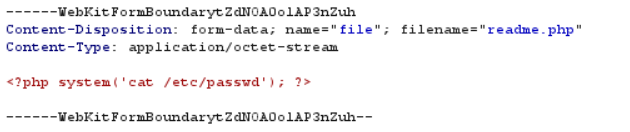
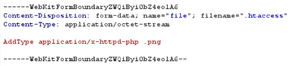
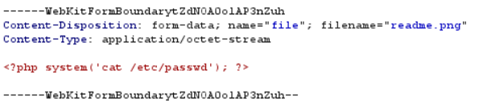
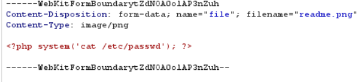
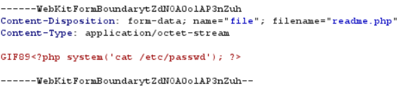

# Lab 1
   Send the **php** file

# Lab 2
   Step 1: Send the **.htaccess** file

   Step 2: Change the extension 

# Lab 3
   Change the **Content-Type**

# Lab 4

   Add a signature to the top of the PHP code

